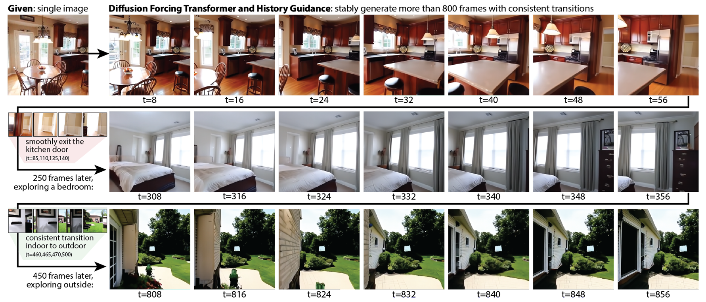

<h1 align="center">Diffusion-Forcing-Aware JEPA-VAE for Minecraft Video Generation</h1>
<p align="center">
  <p align="center">
    <a href="https://kiwhan.dev/">Kiwhan Song*<sup>1</sup></a>
    ·
    <a href="https://boyuan.space/">Boyuan Chen*<sup>1</sup></a>
    ·
    <a href="https://msimchowitz.github.io/">Max Simchowitz<sup>2</sup></a>
    ·
    <a href="https://yilundu.github.io/">Yilun Du<sup>3</sup></a>
    ·
    <a href="https://groups.csail.mit.edu/locomotion/russt.html">Russ Tedrake<sup>1</sup></a>
    ·
    <a href="https://www.vincentsitzmann.com/">Vincent Sitzmann<sup>1</sup></a>
    <br/>
    *Equal contribution <sup>1</sup>MIT <sup>2</sup>CMU <sup>3</sup>Harvard
  </p>
  <h4 align="center">ICML 2025</h4>
  <h3 align="center"><a href="https://arxiv.org/abs/2502.06764">Paper</a> | <a href="https://boyuan.space/history-guidance">Website</a> | <a href="https://huggingface.co/spaces/kiwhansong/diffusion-forcing-transformer">HuggingFace Demo</a> | <a href="https://huggingface.co/kiwhansong/DFoT">Pretrained Models</a></h3>
</p>

This repository extends the [**Diffusion Forcing Transformer (DFoT)**](https://arxiv.org/abs/2502.06764) framework with **Diffusion-Forcing-Aware JEPA-VAE**, a representation learning approach that shapes VAE latents to be action-conditioned and future-predictive while remaining usable for latent video diffusion. Our method integrates a JEPA-style predictive objective applied to VAE latents, trained with teacher forcing to avoid compounding errors, and jointly optimizes diffusion loss, JEPA latent prediction loss, and reconstruction regularization.



## 🎯 Key Contributions

- **JEPA-Style Predictive Objective**: We propose a JEPA-style predictive objective applied to VAE latents to learn action-conditioned, future-predictive representations, addressing representation aliasing concerns for downstream control.
- **Joint Training Paradigm**: We integrate JEPA-VAE training into DFoT-style latent video diffusion, leveraging Diffusion Forcing's per-token noising paradigm for robust long-horizon continuous rollouts.
- **Diffusion-Aware JEPA**: We introduce a diffusion-aware JEPA variant that trains predictiveness under partially noised history, matching DFoT's masking-by-noising regime.
- **Training Protocols**: We present both offline and joint-DFoT training protocols with structured ablations (pairwise vs. trajectory training, teacher forcing vs. autoregressive latent rollouts, noised-context on/off, and freezing vs. finetuning VAE components).

## 🏗️ Architecture Overview

### JEPA-VAE Architecture

The JEPA-VAE architecture consists of three main components:

1. **VAE Encoder (Eψ)**: Encodes each frame `xt` into a latent state `st = vec(μψ(xt))`
2. **Action Encoder (gη)**: Embeds actions `at` into a learned representation `ut = gη(at)`
3. **Latent Predictor (fθ)**: A causal Transformer that predicts the next latent state from history:
   ```
   ŝt+1 = fθ({s0 ∥ u0, ..., st ∥ ut})
   ```

The JEPA objective matches predicted latents to stop-gradient encoder targets:
```
LJEPA = Σt d(ŝt+1, sg(st+1))
```

### Training Regimes

#### 1. Offline JEPA-VAE Fine-tuning

In the **offline setting**, we fine-tune the VAE encoder `Eψ` (decoder frozen) and train the JEPA predictor `fθ` and action encoder `gη` **without updating DFoT**. This isolates whether "better latents" transfer to a fixed diffusion model.

**Offline Training Strategies:**
- **Pairwise-TF**: One-step JEPA from tuples `(xt, at, xt+1)`
- **Rollout-TF**: Trajectory JEPA with teacher forcing (conditions on ground-truth latent history)
- **Rollout-AR**: Trajectory JEPA with autoregressive predictor unrolling

**Key Finding**: Offline JEPA-VAE fine-tuning alone does not transfer cleanly to diffusion-based generation due to latent distribution/geometry mismatch when swapping an updated encoder into a fixed pretrained DFoT denoiser.

#### 2. Joint DFoT + JEPA Training

In the **joint training setting**, we simultaneously optimize the diffusion model and the JEPA-shaped representation so that the latent space is simultaneously good for denoising-based video generation and for action-conditioned predictiveness:

```
min LDFoT + λJ LJEPA + λR Lrec
```

**Why Joint Training Works:**
- DFoT co-adapts to the evolving latent space, avoiding distribution mismatch
- The representation is explicitly shaped for action-conditioned predictiveness
- Teacher forcing provides stable gradients without compounding error artifacts

**Training Modes:**
- **JEPA-0R**: `LDFoT + λJ LJEPA` (no explicit reconstruction)
- **JEPA+R**: `LDFoT + λJ LJEPA + λR Lrec` (with reconstruction regularization)
- **JEPA-AR**: Autoregressive JEPA predictor (ablation, typically performs worse)

## 🚀 Quick Start

### Setup

#### 1. Create a conda environment and install dependencies:
```bash
conda create python=3.10 -n dfot
conda activate dfot
pip install -r requirements.txt
```

#### 2. Connect to Weights & Biases:
We use Weights & Biases for logging. [Sign up](https://wandb.ai/login?signup=true) if you don't have an account, and *modify `wandb.entity` in `config.yaml` to your user/organization name*.

### Joint DFoT + JEPA Training

Train the model with joint diffusion-aware JEPA training. This command jointly optimizes DFoT, JEPA predictor, and VAE encoder:

```bash
python main.py \
  +name=jepa_minecraft_2xa100_b \
  experiment=video_generation \
  dataset=minecraft \
  algorithm=dfot_video_jepa \
  dataset_experiment=minecraft_video_generation_jepa \
  wandb.entity=local \
  wandb.mode=disabled \
  dataset.max_frames=8 \
  dataset.context_length=4 \
  load=pretrained:DFoT_MCRAFT.ckpt \
  algorithm.checkpoint.strict=false \
  @DiT/B \
  @diffusion/continuous \
  experiment.training.batch_size=1 \
  experiment.validation.batch_size=1 \
  algorithm.vae.batch_size=1 \
  experiment.training.max_epochs=15 \
  experiment.training.checkpointing.every_n_train_steps=1000 \
  experiment.training.checkpointing.every_n_epochs=null \
  dataset.subdataset_size=null \
  experiment.validation.limit_batch=0 \
  algorithm.jepa.loss_weight=0 \
  algorithm.jepa.recon_loss_weight=0.5 \
  experiment.find_unused_parameters=true \
  algorithm.jepa.training_mode=teacher_forcing
```

**Key Parameters:**
- `algorithm.jepa.loss_weight`: Weight for JEPA loss (set to 0 to disable JEPA, >0 to enable)
- `algorithm.jepa.recon_loss_weight`: Weight for reconstruction regularization (0.5 recommended)
- `algorithm.jepa.training_mode`: Set to `teacher_forcing` (recommended) or `autoregressive` (ablation)
- `load=pretrained:DFoT_MCRAFT.ckpt`: Loads pretrained DFoT checkpoint (set to your checkpoint path)

### Validation/Inference

Run validation/inference with a trained JEPA model:

```bash
python main.py \
  +name=jepa_inference \
  experiment=video_generation \
  dataset=minecraft \
  algorithm=dfot_video_jepa \
  dataset_experiment=minecraft_video_generation_jepa \
  @DiT/B \
  @diffusion/continuous \
  wandb.entity=local \
  wandb.mode=disabled \
  load=<path_to_your_checkpoint> \
  algorithm.checkpoint.strict=false \
  'experiment.tasks=[validation]' \
  experiment.validation.batch_size=1 \
  dataset.num_eval_videos=20 \
  dataset.max_frames=8 \
  dataset.context_length=4 \
  dataset.n_frames=8 \
  experiment.find_unused_parameters=true \
  experiment.ema.enable=false
```

**Note**: Replace `<path_to_your_checkpoint>` with the path to your trained checkpoint.

### Model Weights

Pretrained model weights are available for download:

- [Offline Model Weights (Folder 1)](https://drive.google.com/drive/folders/1ZsbWxlDTVMPQ0hKkyEwccg52-NiPbXC-?usp=sharing)
- [Joint JEPA Model Weights (Folder 2)](https://drive.google.com/drive/folders/1DlesLbtgslPcmyGSjFQINlTNjqGbOUXB?usp=sharing)

## 📊 Experimental Results

### Joint Training Results

Our joint diffusion-aware JEPA training achieves:

| Method | FID ↓ | FVD ↓ | IS ↑ | LPIPS ↓ | MSE ↓ | PSNR ↑ | SSIM ↑ |
|--------|-------|-------|------|---------|-------|--------|--------|
| Recon-FT (baseline) | 83.63 | 215.25 | 3.25 | 0.408 | 0.0175 | 17.56 | 0.499 |
| **JEPA-0R (ours)** | **78.25** | **193.25** | **3.41** | **0.389** | 0.0162 | 17.90 | **0.516** |
| JEPA+R (ours) | 80.63 | 212.63 | 3.26 | 0.402 | **0.0161** | **17.94** | 0.501 |
| JEPA-AR (ablation) | 88.56 | 264.25 | 3.21 | 0.420 | 0.0217 | 16.64 | 0.484 |

**Key Findings:**
- **JEPA-0R** achieves the best temporal quality (FVD) and realism (FID)
- Joint training resolves latent distribution mismatch seen in offline fine-tuning
- Teacher forcing provides cleaner supervision than autoregressive rollouts
- Reconstruction regularization improves pixel metrics but can constrain dynamics shaping

### Offline Training Results

Offline JEPA-VAE fine-tuning with a fixed DFoT denoiser:

| Method | FID ↓ | FVD ↓ | IS ↑ | LPIPS ↓ | MSE ↓ | PSNR ↑ | SSIM ↑ |
|--------|-------|-------|------|---------|-------|--------|--------|
| Vanilla (no fine-tuning) | 82.44 | 196.75 | 3.49 | 0.372 | 0.0149 | 18.26 | 0.554 |
| Pairwise-TF | 135.63 | 329.75 | 3.45 | 0.531 | 0.0245 | 16.10 | 0.500 |
| Rollout-TF | 88.75 | 263.75 | 3.37 | 0.405 | 0.0179 | 17.45 | 0.507 |
| Rollout-AR | 121.56 | 439.75 | 3.61 | 0.535 | 0.0248 | 16.05 | 0.490 |

**Key Finding**: Offline updating the encoder hurts generation quality relative to vanilla pretrained DFoT+VAE pipeline, consistent with latent distribution/geometry mismatch.

## 🔬 Method Details

### Why Teacher Forcing?

Our goal is to learn better latents, not to deploy `fθ` as the rollout model. If we train `fθ` autoregressively (feeding back `ŝt+1`), early prediction errors compound, and gradients to the encoder become dominated by "error amplification" artifacts rather than true representational deficiency. Teacher forcing instead conditions each prediction on the ground-truth latent history `{s≤t}`, yielding:
1. A well-conditioned supervised signal for "is `st` informative enough to predict `st+1` under action `at`?"
2. Stable gradients to `Eψ` that encourage preserving transition-relevant details
3. A clean ablation axis: we still evaluate an autoregressive variant to quantify the gap

### Diffusion-Forcing Awareness

A key mismatch can arise if JEPA trains predictiveness only from clean histories, while DFoT sampling may present partially corrupted histories due to per-token noising. To align the representation objective with DFoT conditions, we optionally noise the JEPA predictor's context states using the same `(α, σ)` schedule:

```
s̃t = α(kt) st + σ(kt) ξt,  ξt ~ N(0, I)
```

and predict clean next-state targets:
```
ŝt+1 = fθ({s̃0 ∥ u0, ..., s̃t ∥ ut})
```

This trains latents to remain predictive even when history is partially "masked" by noise, mirroring DFoT's training/sampling regime.


## 📝 Acknowledgements

This repo extends [Boyuan Chen](https://boyuan.space/)'s research template [repo](https://github.com/buoyancy99/research-template) and the original [Diffusion Forcing Transformer](https://github.com/kwsong0113/diffusion-forcing-transformer) implementation. By its license, we ask you to keep the above sentences and links in `README.md` and the `LICENSE` file to credit the authors.

## 📌 Citation

If our work is useful for your research, please consider giving us a star and citing our paper:

```bibtex
@misc{song2025historyguidedvideodiffusion,
  title={History-Guided Video Diffusion}, 
  author={Kiwhan Song and Boyuan Chen and Max Simchowitz and Yilun Du and Russ Tedrake and Vincent Sitzmann},
  year={2025},
  eprint={2502.06764},
  archivePrefix={arXiv},
  primaryClass={cs.LG},
  url={https://arxiv.org/abs/2502.06764}, 
}
```

For the JEPA-VAE extension:

```bibtex
@misc{kumar2025diffusionforcingawarejepavae,
  title={Diffusion-Forcing-Aware JEPA-VAE for Minecraft Video Generation},
  author={Satyam Kumar and Jayesh Chaudhari},
  year={2025},
  note={Extension of History-Guided Video Diffusion}
}
```
